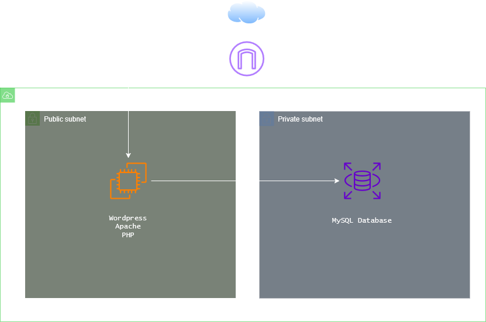

# 🏗 Automated WordPress Infrastructure on AWS using Terraform

> Production-style Infrastructure as Code deployment of a secure WordPress environment on AWS.

---

## 📌 Executive Summary

This project demonstrates the implementation of a secure, automated, and reproducible WordPress deployment on Amazon Web Services (AWS) using Terraform and Terraform Cloud.

The infrastructure is fully defined as code, version-controlled via GitHub, and deployed through a remote execution workflow, following modern DevOps and Infrastructure as Code (IaC) principles.

The architecture enforces network isolation, security best practices, and automated application provisioning.

---

## 🧱 Architecture Overview

### Core Components

- **Custom VPC**
- **Public Subnet** (Web Layer)
- **Private Subnet** (Database Layer)
- **Internet Gateway**
- **Route Tables**
- **Security Groups**
- **EC2 Instance** (Apache + PHP + WordPress)
- **RDS MySQL Instance** (Private)
- **Terraform Cloud Workspace**

### Architectural Principles

✔ Network Segmentation  
✔ Least Privilege Access  
✔ Infrastructure as Code  
✔ Automated Provisioning  
✔ Layered Security Model  

---

## 🌐 High-Level Architecture

